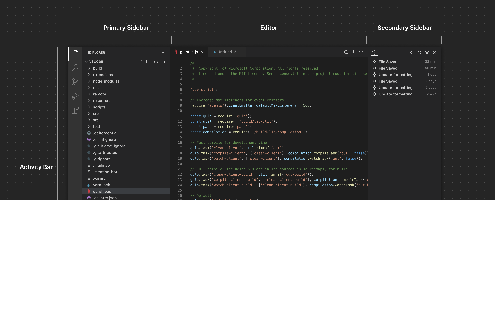

# VSCode 界面

## 容器

VSCode 界面主要被划分为两个主要概念：容器和项。

容器可以被认为是可导航的控件，它可以包含一个或多个项目。  
例如侧边栏就是容器，其中包含一个目录树，并且是可导航的。

一个项目是由 VSCode 定义的概念，它是一个被渲染为可视控件、可选择的元素的窗口的一部分 。  
例如，侧边栏包含一个活动元素，侧边栏的项目是树视图中的条目，窗口的底部包含一个活动元素，而编辑器中的选项卡也是活动元素。  
除了元素之外，项目还可以包含其他项目。侧边栏上的项目可以是树视图或自定义视图容器，容器可以进一步包含其他容器或项目。 一个例子是一个编辑器，它包含一组选项卡，其中每一个选项卡代表一个单独的项目，这个项目本身又包含编辑器中的活动文本视图。

### 活动栏

活动栏是 VS Code 中的一个核心导航界面。扩展可以向活动栏添加项目，这些项目充当视图容器，在主侧边栏中呈现视图。

### 主侧边栏

主侧边栏会呈现一个或多个视图。活动栏与主侧边栏紧密关联。点击一个添加到活动栏的项目（即视图容器），会打开主侧边栏，并在其中呈现与该视图容器相关联的一个或多个视图。  
一个具体的例子就是资源管理器。点击资源管理器项目会打开主侧边栏，在其中可以看到文件夹、时间轴和大纲视图。

### 辅助侧边栏

辅助侧边栏也可用作渲染包含视图的视图容器的界面。用户可以将诸如 “终端” 或 “问题” 视图之类的视图拖到辅助侧边栏，以自定义其布局。

### 编辑器

编辑器区域包含一个或多个编辑器组。扩展可以提供 自定义编辑器 或 网页视图 以在编辑器区域中打开。它们还可以提供 编辑器操作 以在编辑器工具栏中显示额外的图标按钮。

### 面板

面板是另一个用于显示视图容器的区域。默认情况下，诸如终端、问题和输出等视图一次只能在面板的单个选项卡中查看。用户还可以像在编辑器中那样，将视图拖入拆分布局。此外，扩展可以选择专门将视图容器添加到面板中，而不是添加到活动栏/主侧边栏中。

### 状态栏

状态栏 提供有关工作区和当前活动文件的上下文信息。它呈现两组 状态栏项。

## 项

扩展可以向上述各种容器添加项目。

### 视图

视图可以以树形视图、欢迎视图或 Web 视图的形式提供，并且可以拖拽到界面的其他区域。

### 视图工具栏

扩展可以公开特定于视图的操作，这些操作以按钮的形式出现在视图工具栏上。

### 侧边栏工具栏

也可以将作用于整个视图容器的操作公开在侧边栏工具栏中。

### 编辑器工具栏

扩展可以直接在编辑器工具栏中贡献作用于当前编辑器的操作。

### 面板工具栏

面板工具栏可以展示与当前所选视图相关的作用域选项。例如，终端视图会提供新建终端、拆分视图布局等操作；切换到“问题”视图后，则会显示另一组不同的操作。

### 状态栏项

左侧的状态栏项作用于整个工作区；右侧的状态栏项则作用于当前打开的文件。

## 通用界面元素

### 命令面板

扩展可以向命令面板贡献命令，以便快速执行某些功能。

### 快速选择

快速选择通过多种方式捕获用户输入：可要求单选、多选，甚至支持自由文本输入。

### 通知

通知用于向用户传达信息、警告和错误消息，也可用于显示进度。

### Web 视图

当需求超出 VS Code “原生” API 的能力时，可使用 Web 视图展示自定义内容与功能。

### 上下文菜单

与命令面板固定位置不同，上下文菜单让用户可在特定位置直接执行操作或进行配置。

### 引导式教程

引导式教程通过多步骤清单与丰富内容，为用户提供一致的扩展入门体验。

### 设置

设置允许用户配置与扩展相关的各项选项。
