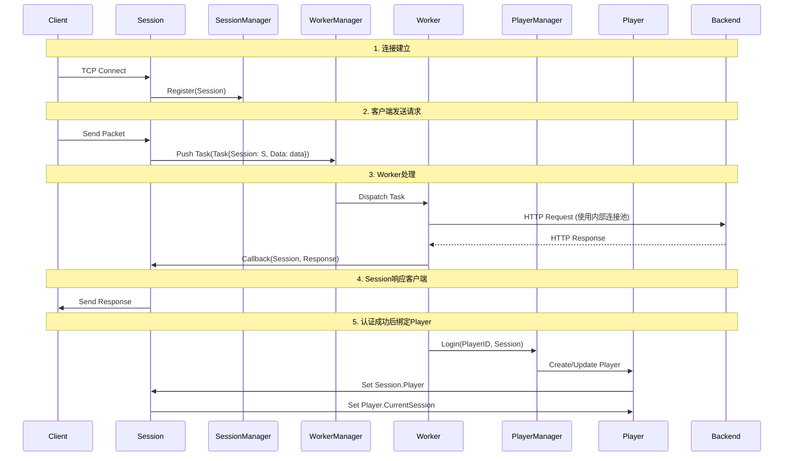

# 模块设计实例：基于Go的网关设计2

## 网关模块架构设计

### 模块职责清晰划分

| 模块 | 职责 | 核心属性与方法 |
| :--- | :--- | :--- |
| **`gate`** | **程序入口与总协调员** | `func main()`: 初始化所有模块，启动服务。 |
| **`config`** | **配置提供者** | `LoadConfig()`: 加载网关配置（如端口、Worker数量、后端地址等）。提供全局配置结构体。 |
| **`SessionManager`** | **会话容器** | `sessions map[SessionID]*Session`: 管理所有活跃的Session。提供`CreateSession()`, `GetSession()`, `RemoveSession()`方法。 |
| **`Session`** | **连接的抽象** | `ID SessionID`, `Conn net.Conn`, `Player *Player`: 代表一个客户端连接。持有物理连接和对应的玩家状态引用。 |
| **`PlayerManager`** | **玩家容器** | `players map[PlayerID]*Player`: 管理所有在线玩家。提供`Login()`, `Logout()`, `GetPlayer()`方法。处理顶号逻辑。 |
| **`Player`** | **玩家的抽象** | `ID PlayerID`, `CurrentSession *Session`: 代表一个玩家。持有玩家业务状态和当前所在的会话引用。 |
| **`WorkerManager`** | **Worker池管理器** | `workers []*Worker`, `taskChan chan Task`:  1. 维护一个Worker池。 2. 接收来自Session的请求（Task），并分配给空闲的Worker处理。 |
| **`Worker`** | **请求的处理单元** | `ID int`, `BackendClient http.Client`:  1. 每个Worker是一个Goroutine。 2. **内部维护一个到后端服务的连接池**。 3. 从`taskChan`取任务，调用后端服务，将结果返回给对应的Session。 |

---

### 核心工作流程

下图展示了客户端请求的完整处理流程，特别是各模块如何协同工作：

---

### 设计解读与优势

#### 1. 模块关系解读

- **`Session` & `Player`**：这是核心的二元关系。`Session`是**通道**，`Player`是**内容**。一个`Player`在不同时间可以绑定不同的`Session`（重连、顶号），一个`Session`在认证后绑定一个`Player`。
- **`WorkerManager` & `Worker`**：这是**生产者-消费者**模型。`WorkerManager`是任务分发中心（生产者），`Worker`是处理单元（消费者）。所有来自客户端的请求都被抽象为`Task`，扔进`taskChan`，由空闲的`Worker`获取并处理。
- **`SessionManager` & `PlayerManager`**：这是**状态管理**二人组。`SessionManager`管网络连接状态，`PlayerManager`管游戏业务状态。

#### 2. 为何这样设计？

- **清晰的生命周期**：
  - `Session`生命周期 = TCP连接周期。
  - `Player`生命周期 = 玩家登录到登出的周期。
  - 两者通过管理器解耦，又可以通过指针相互关联。
- **高效的异步处理**：
  - `Session`（I/O）只负责收发包和拆包粘包，快速将请求扔进`taskChan`，不阻塞网络循环。
  - `Worker`（计算与后端I/O）负责慢操作，处理完后通过回调通知原`Session`。
  - 通过`Worker`池的大小，可以严格控制并发请求数，保护后端。
- **完美的资源隔离**：
  - 每个`Worker`内部有**自己独享的连接池**。这意味着不同`Worker`之间的后端连接是隔离的，一个`Worker`的后端连接池出现问题不会影响其他`Worker`。
  - 您可以配置`Worker`池的大小和每个`Worker`私有连接池的大小，实现精细化的资源控制。

### 总结

这个架构的核心思想是：

- **`Session`/`Player`** 管理状态和关系。
- **`WorkerManager`/`Worker`** 处理流程和计算，并且每个`Worker`拥有**独立的、隔离的后端资源**。

它既保证了客户端请求处理的异步高效，又通过`Worker`私有连接池的模式实现了资源隔离，非常适合对客户端体验和隔离性要求很高的游戏服务器网关。

## 错误处理

### 一、错误处理的核心思路：分层分类，就近处理

错误应在最具备处理上下文信息的模块中被解决。整个系统的错误处理形成一个漏斗，底层错误被捕获消化，无法处理的则转化为高层错误向上传递或终止流程。

#### 1. 网络I/O层错误 (`Session`/`Connection` 模块)

- **错误来源**：TCP连接读写超时、连接被对端重置、非正常断开。
- **处理思路**：视为此连接的**正常生命周期结束**。无需恐慌，记录日志用于网络质量分析即可。核心操作是**触发该会话的清理流程**：通知 `SessionManager` 将此会话从注册表中移除，并通知 `PlayerManager` 解绑玩家与会话的关系。

#### 2. 业务逻辑层错误 (`Worker` 模块)

- **错误来源**：调用后端服务失败（网络超时、4xx/5xx状态码）、后端返回的数据格式异常。
- **处理思路**：**将后端错误“翻译”成客户端能理解的协议**。绝不能让后端错误直接导致网关崩溃或连接断开。策略包括：
  - **重试**：对于网络抖动等临时性错误，进行有限次数的重试。
  - **降级**：重试后仍失败，则构造一个明确的错误码响应消息，通过 `Session` 发送回客户端，告知其请求失败原因（如“服务繁忙，请稍后再试”）。
  - **记录与告警**：此类错误需要记录详细日志并触发告警，因为它表明后端服务可能出现了问题。

#### 3. 状态一致性错误 (`SessionManager`/`PlayerManager` 模块)

- **错误来源**：试图向一个已失效的 `Session` 发送消息、玩家顶号时的状态冲突。
- **处理思路**：**执行状态修复**。这是维护系统数据一致性的最后防线。例如，收到发往已注销会话的消息，直接静默丢弃并记录日志。处理顶号时，果断清理旧会话资源，确保 `Player` 对象只绑定到最新的 `Session` 上。

#### 4. 全局性错误 (`Gate` 主模块)

- **错误来源**：模块初始化失败、配置加载错误、监听端口被占用。
- **处理思路**：**快速失败**。此类错误通常在启动阶段发生，且无法自行恢复。一旦发生，应记录错误日志并立即终止程序，让运维人员介入处理。

---

### 二、关闭模块的核心思路：反向依赖，有序退出

优雅关闭的核心是**依赖倒置**。依赖方（上层模块）负责启动，而被依赖方（下层模块）负责提供关闭接口，并由依赖方按顺序调用。

1. **关闭信号流**：由 `Gate` 主模块接收外部终止信号（如SIGTERM），然后**反向**沿着模块依赖链依次触发关闭流程。顺序是：**HTTP Server -> TCP Server -> WorkerManager -> SessionManager -> PlayerManager**。

2. **各模块的关闭职责**：
    - **`TCPServer`**：立即停止接受新连接。这步很快。
    - **`HTTP Server`**：停止监听HTTP端口，并等待已接收的请求处理完毕。
    - **`WorkerManager`**：关闭任务队列Channel，并等待所有正在忙碌的 `Worker` 处理完当前任务后退出。这会停止所有新的后端请求。
    - **`SessionManager`**：向所有活跃的 `Session` 广播关闭信号。
    - **`Session`**：收到关闭信号后，停止读写循环，关闭TCP连接。
    - **`PlayerManager`**：等待所有 `Session` 关闭后，清理玩家状态。此时所有玩家都已下线。

3. **超时控制**：`Gate` 主模块为整个关闭过程设置一个总超时时间（例如30秒）。如果超时后仍有模块未关闭完成，则强制终止并记录警告日志，防止关闭流程被某个“顽固”连接或任务无限期挂起。

**总结**：错误处理是**自下而上**的捕获、翻译与消化；而优雅关闭是**自上而下**的通知、等待与终止。两者共同保证了系统在异常情况下的稳定性和数据一致性。

## 通信管道

---

### 核心数据流管道

1. **Session → WorkerManager：任务请求管道 (Task Channel)**
    - **通信方向**：Session -> WorkerManager
    - **消息类型**：`Task` 结构体。
    - **内容**：包含产生该请求的源 `Session` 的引用（用于回调）和从网络连接中读取并初步解析后的原始数据包（`Data []byte`）。这是驱动整个网关处理流程的**核心生产通道**。

2. **WorkerManager ↔ Worker：内部任务分发管道 (Worker-specific Task Channel)**
    - **通信方向**：WorkerManager -> (各个)Worker
    - **消息类型**：`Task` 结构体。
    - **内容**：WorkerManager 作为调度器，从公共任务管道获取 `Task` 后，会根据负载策略（如轮询）将其投递到某个 Worker 的私有任务管道中。每个 Worker 在自己的 Goroutine 中监听这个私有管道。

3. **Worker → Session：响应回调 (Response Callback)**
    - **通信方向**：Worker -> Session
    - **消息类型**：**方法调用**（非管道），传递 `Response` 结构体。
    - **内容**：Worker 处理完后端请求后，通过调用 `Task` 中保存的 `Session` 引用所提供的方法（如 `SendResponse`）来回传结果。消息是经过处理的后端响应数据，通常包含状态码、响应体等。

### 状态与管理控制管道

4. **Worker → PlayerManager：登录/绑定事件**
    - **通信方向**：Worker -> PlayerManager
    - **消息类型**：**方法调用**（如 `Login(playerID, session)`）。
    - **内容**：当 Worker 处理认证请求成功後，会向 `PlayerManager` 发出指令，内容包含玩家唯一标识 (`PlayerID`) 和当前有效的 `Session` 引用，触发玩家状态的创建或更新。

5. **Session → PlayerManager：连接断开事件**
    - **通信方向**：Session -> PlayerManager
    - **消息类型**：**方法调用**（如 `OnSessionClosed(session)` 或 `Logout(playerID)`）。
    - **内容**：当 `Session` 检测到连接断开时，除了自行清理，还会通知 `PlayerManager`。`PlayerManager` 会根据会话与玩家的绑定关系，执行玩家下线或状态清理（如解除绑定，但可能保留玩家数据一段时间）的逻辑。

6. **PlayerManager ↔ Session/Player：状态同步指令**
    - **通信方向**：PlayerManager -> Session, PlayerManager -> Player
    - **消息类型**：**直接的属性赋值/指针操作**（非管道）。
    - **内容**：在登录/顶号过程中，`PlayerManager` 会直接修改 `Session.Player` 和 `Player.CurrentSession` 这两个指针，建立或切断两者之间的双向关联关系。这是一种高效的内部状态同步。

### 配置与生命周期管理管道

7. **Config模块 → 所有模块：配置供给**
    - **通信方向**：Config -> Gate -> 所有模块
    - **消息类型**：**只读的配置结构体**或**通过接口获取的配置值**。
    - **内容**：在网关启动初始化时，`gate`模块从`config`模块加载完整配置，然后将**配置副本**或**配置对象的只读引用**传递给其他各个模块（如`WorkerPoolSize`给`WorkerManager`，`ListenAddr`给`SessionManager`等）。

8. **Gate模块 → 所有模块：关闭与优雅终止信号**
    - **通信方向**：Gate -> 所有管理器模块（SessionManager, PlayerManager, WorkerManager）
    - **消息类型**：**Context 取消信号**或 **`chan struct{}` 关闭信号**。
    - **内容**：当收到系统中断信号（如SIGTERM）时，`gate`主协程会关闭一个全局的 `shutdownChan` 或取消一个全局的 `context.Context`。所有管理器模块会监听这个信号，并开始执行优雅关闭流程：停止接受新连接、等待进行中的请求处理完毕、释放资源等。

9. **SessionManager → Session：连接控制信号**
    - **通信方向**：SessionManager -> Session
    - **消息类型**：**方法调用**（如 `Close()`）或通过**共享的 `Context`**。
    - **内容**：在优雅关闭或由于某些管理策略（如强制踢人）需要主动断开连接时，`SessionManager` 会遍历并调用特定或所有 `Session` 对象的 `Close` 方法，触发连接关闭序列。

### 监控与可观测性管道

10. **所有模块 → 监控模块(Metrics)：指标数据管道**
    - **通信方向**：Session, Worker, PlayerManager -> Metrics
    - **消息类型**：**方法调用**（如 `IncCounter()`, `ObserveLatency()`）或通过**单独的 `chan MetricsEvent`**。
    - **内容**：各个模块在关键节点（收到请求、处理完成、连接建立、断开、玩家登录等）上报指标数据，如请求耗时、在线连接数、活跃玩家数、错误计数等，用于监控和报警。

---

### 总结

| 编号 | 通信管道 | 方向 | 消息类型 | 目的 |
|--- |--- |--- |--- |--- |
| 1 | 任务请求管道 | Session → WM | `Task` | 接收客户端请求，投入处理队列 |
| 2 | 任务分发管道 | WM → Worker | `Task` | 将任务分发给具体工作单元 |
| 3 | 响应回调 | Worker → Session | `Response` | 将处理结果返回给客户端连接 |
| 4 | 登录事件 | Worker → PM | `(PlayerID, Session)` | 请求绑定玩家状态与网络会话 |
| 5 | 断开事件 | Session → PM | `(Session/PlayerID)` | 通知玩家下线或状态清理 |
| 6 | 状态同步 | PM ↔ Session/Player | **指针操作** | 建立/切断会话与玩家的关联 |
| 7 | 配置供给 | Config → All | `Config Struct` | 供给运行时配置参数 |
| 8 | 终止信号 | Gate → All | `Context` / `chan` | 通知所有模块开始优雅关闭 |
| 9 | 连接控制 | SM → Session | `Close Signal` | 主动管理连接生命周期 |
| 10 | 指标上报 | All → Metrics | `MetricsEvent` | 上报监控指标，用于可观测性 |

这些管道和通信机制共同构成了一个高效、可控、可观测的异步处理系统，保证了网关的稳定性、高性能和易于维护的特性。
