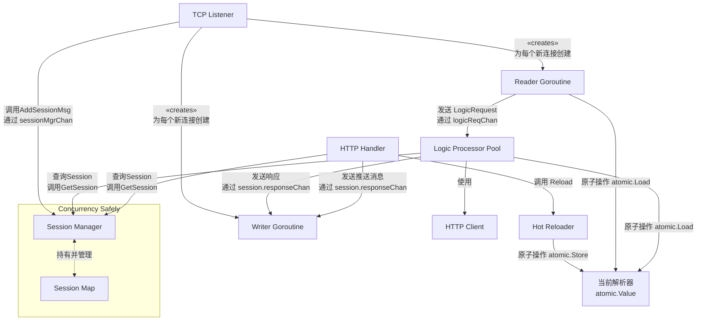
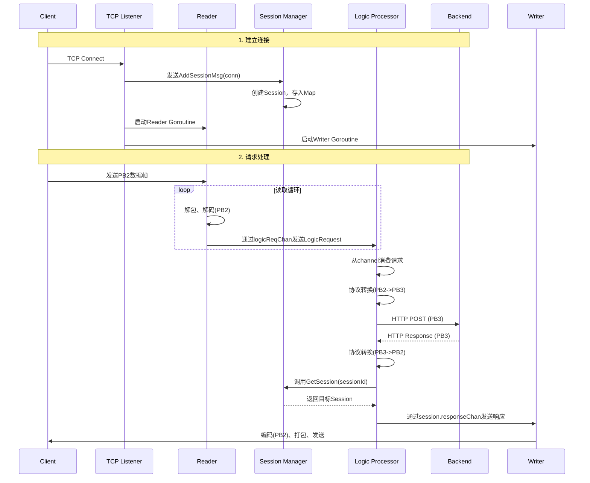
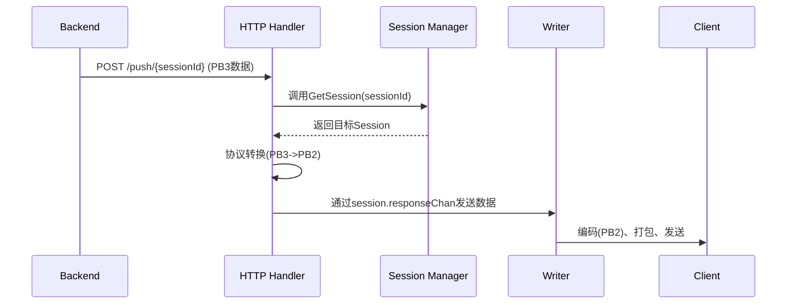
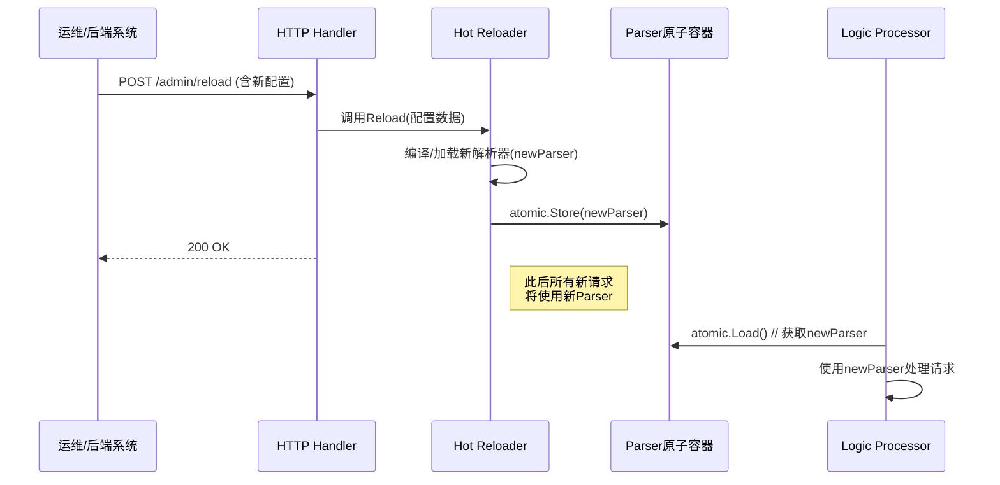

# 模块设计实例：基于Go的网关设计

好的，我们来重新整理一下网关的模块设计和并发流程。

---

## 一、网关模块设计

整个网关由以下核心模块构成，模块间通过清晰的接口和通道进行通信，遵循“通过通信来共享内存”的原则。

| 模块 | 职责 | 并发模型 | 关键依赖注入 |
| :--- | :--- | :--- | :--- |
| **Main** | 程序入口，初始化容器，启动/停止所有模块 | 1个主Goroutine | 配置 |
| **Config** | 加载和提供配置信息 | 被动工具类，无Goroutine | - |
| **Session Manager** | Session生命周期的集中管理（CRUD） | **1个管理Goroutine**（推荐） | - |
| **TCP Listener** | 监听客户端TCP连接，接受新连接 | 1个监听Goroutine | Session Manager, Logic Processor |
| **Reader** | 从TCP连接读取、解包、解码客户端请求 | **每连接1个Goroutine** | 全局请求Channel |
| **Logic Processor** | 处理业务逻辑，与后端服务HTTP交互 | **固定Worker池（N个Goroutine）** | HTTP Client, Session Manager |
| **Writer** | 向TCP连接编码、打包、写入返回数据 | **每连接1个Goroutine** | Session的响应Channel |
| **HTTP Handler** | 提供API接收后端主动推送和管理指令 | **由`http.Server`管理Goroutine池** | Session Manager, Hot Reloader |
| **Hot Reloader** | 执行协议解析器的热更新 | 被动，由HTTP Handler调用 | - |

---

## 二、模块间联系与通信机制

下图清晰地展示了各模块间的数据流与控制流，特别是基于Channel的通信机制：

**图例说明：**

* **实线箭头**：表示数据流动的主要方向，通常通过 **Channel** 实现。
* **虚线箭头**：表示控制流的调用或查询，通常通过**接口方法调用**实现，内部由**锁**或**Channel**保证线程安全。
* **`atomic.Value`**：表示通过原子操作进行读写的共享资源。

---

## 三、并发工作流程

### 1. 客户端请求处理流程 (下行: Client -> Backend)

### 2. 后端主动推送流程 (上行: Backend -> Client)

### 3. 热重载流程

---

## 四、并发安全总结

1. **Session Map**：通过 **Session Manager 的单一Goroutine** 或 **`sync.RWMutex`** 保护，避免并发读写冲突。
2. **请求流 (logicReqChan)**：通过 **带缓冲的Channel** 传递，Logic Processor池以生产者-消费者模型安全消费。
3. **响应流 (session.responseChan)**：每个Session独占一个Channel，仅供其Logic Processor和Writer使用，天然安全。
4. **解析器 (Parser)**：通过 **`atomic.Value`** 实现原子性的读写，无锁且高效。
5. **HTTP Client**：标准库提供，**线程安全**，可被多个Goroutine并发使用。
6. **配置**：在启动时通过**依赖注入**传递给各模块，运行时为只读，无需同步。

这个设计通过Goroutine和Channel的巧妙运用，将复杂的并发控制转化为清晰的数据流，最大限度地减少了显式锁的使用，从而构建了一个高性能、高并发且易于维护的网关系统。
