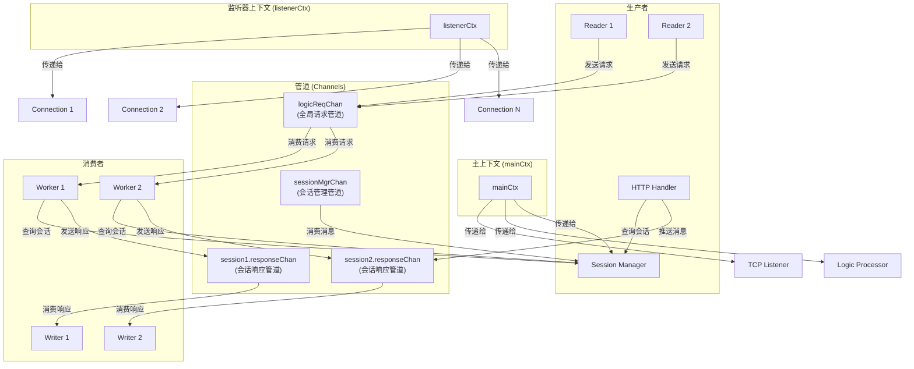

---
tag:
- go
---

# 网关设计：管道和上下文

好的，这是一个非常重要的问题。清晰地理解管道（Channel）和上下文（Context）的分布与用途，是掌握这个网关并发设计的关键。

下图直观地展示了网关中核心管道与上下文的分布及其数据流：

---

## 一、管道 (Channels)

管道是Go中用于Goroutine之间**通信和同步**的核心原语。在我们的网关中，它们扮演着数据总线的角色。

### 1. 全局请求管道 (`logicReqChan`)

- **类型**：`chan *LogicRequest` (有缓冲)
- **生产者**：所有 **Reader Goroutine** (每个TCP连接一个)。
- **消费者**：所有 **Logic Processor Worker Goroutine** (固定数量)。
- **用途**：作为**下行请求的中转站**。Reader将解码后的客户端请求放入此管道，Logic Worker从中取出并处理后端HTTP请求。**这是解耦网络I/O和业务处理的关键**。

### 2. 会话响应管道 (`session.responseChan`)

- **类型**：`chan *ResponseMessage` (通常无缓冲)
- **生产者**：**Logic Processor Worker** (处理完后端响应时) 和 **HTTP Handler** (后端主动推送时)。
- **消费者**：**专属的 Writer Goroutine** (每个TCP连接一个)。
- **用途**：作为**上行响应的专用通道**。保证每个连接的响应都能有序、安全地返回到正确的客户端。这是解耦业务处理和网络回写的关键。

### 3. 会话管理管道 (`sessionMgrChan`)

- **类型**：`chan interface{}` (有缓冲)
- **生产者**：**TCP Listener** (创建Session时) 和 **其他需要管理Session的模块**。
- **消费者**：**Session Manager 的管理循环** (唯一消费者)。
- **用途**：将并发的Session增删改操作**串行化**。所有对Session Map的修改都通过此管道发送消息，由Session Manager统一处理，从而避免对Map的并发访问冲突。

---

## 二、上下文 (Contexts)

上下文用于在Goroutine之间**传递截止时间、取消信号和其他请求范围的值**。在我们的网关中，它们扮演着流程控制和优雅关机指挥者的角色。

### 1. 主上下文 (`mainCtx`)

- **创建点**：`main` 函数中，`context.WithCancel(context.Background())`。
- **传递方向**：由 `main` 函数传递给 **所有主要模块的 `ListenAndServe` 或 `Run` 方法** (如TCPListener, HTTPHandler, SessionManager, LogicProcessor)。
- **用途**：**接收全局关机信号**（如SIGINT, SIGTERM）。当 `main` 函数调用 `cancel()` 时，所有监听 `mainCtx.Done()` 的模块都会开始自己的优雅关机流程。

### 2. 监听器上下文 (`listenerCtx`)

- **创建点**：`TCPListener` 初始化时，`context.WithCancel(context.Background())`。
- **传递方向**：由 `TCPListener` 传递给**每个新连接的 `handleConnection` 或 `Session`**。
- **用途**：**接收连接级别的关机信号**。当 `TCPListener.Shutdown()` 被调用时，它会触发 `listenerCancel()`，通知所有活跃连接的读写循环：“服务器要关闭了，请立即退出”。这确保了所有连接都能被及时清理。

### 3. 请求上下文 (`requestCtx`)

- **创建点**：通常在 `Logic Processor` 处理每个请求时，`context.WithTimeout(context.Background(), timeout)`。
- **传递方向**：伴随每个请求，传递给 **HTTP Client** 的 `Do` 方法。
- **用途**：**为每个发给后端的HTTP请求设置超时**。如果后端在指定时间内没有响应，请求会被自动取消，防止请求无限期挂起，耗尽网关资源。

## 总结

| 类型         | 名称                  | 主要用途                           | 通信方向                      |
| :----------- | :-------------------- | :--------------------------------- | :-------------------------- |
| **Channel**  | `logicReqChan`        | 解耦网络读取与业务处理             | Reader -> Logic Processor   |
|              | `session.responseChan`| 解耦业务处理与网络回写             | Logic Processor -> Writer   |
|              | `sessionMgrChan`      | 串行化会话管理操作，避免锁竞争     | Various -> Session Manager  |
| **Context**  | `mainCtx`             | 传播全局关机信号，触发优雅关机     | main -> All Modules         |
|              | `listenerCtx`         | 传播连接级关机信号，清理所有连接   | Listener -> All Sessions    |
|              | `requestCtx`          | 控制单个后端请求的超时             | Logic Processor -> HTTP Client |

**管道 (Channel)** 是**数据的高速公路**，负责在不同模块间**传输请求和响应**。
**上下文 (Context)** 是**信号的广播塔**，负责在Goroutine树中**传播取消和超时信号**。

两者协同工作，共同构建了一个既高效又可控的并发系统。
