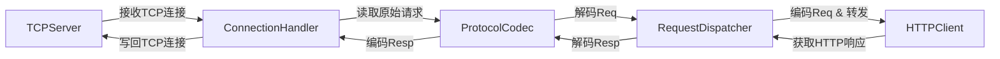

# 通用模块设计示例

现在我需要使用Go来重构之前使用python编写的网关，该网关的主要功能是接收来自于客户端的TCP连接，并从连接中获取来自客户端的请求，将客户端请求使用protobuf编码后转发给对应的后端（使用HTTP），并接收来自后端的响应，使用protobuf解码后返回给前端（通过TCP连接）。

## 模块设计

非常好！我们将严格按照**定义->分解->隔离->连接**的四步法，来设计这个Go版本的TCP/HTTP协议转换网关。

---

### 第一步：定义 (Define) - 确定系统边界和核心职责

1. 核心职责 (一句话说清)
    “本网关的核心职责是**在TCP字节流协议与HTTP协议之间进行双向透明转换，并完成Protobuf格式的编解码**。”

2. 契约/接口 (模块对外提供的服务)
    从外部看，网关是一个黑盒，其启动接口非常简单：

    ```go
    // 网关应用的生命周期管理
    type GatewayApp interface {
        Run(ctx context.Context) error   // 启动网关，阻塞运行，直到ctx被取消
        Shutdown(ctx context.Context) error // 优雅关闭
    }
    ```

3. 错误边界
   * 启动失败：端口被占用、配置错误。
   * 运行时错误：TCP连接失败、HTTP请求失败、Protobuf编解码失败、连接超时。
   * 处理策略：记录错误日志、关闭异常连接、返回错误码给客户端（如果协议支持）。

**输出物**：我们明确了系统作为一个整体是干什么的。

---

### 第二步：分解 (Decompose) - 拆分子模块与工作流

我们将核心职责分解为以下几个关键子模块，其工作流程与数据流如下图所示：



下面我们来定义图中每个模块的职责：

1. **`TCPServer`（TCP服务器模块）**
    * **职责**：监听指定TCP端口，接受新连接，管理连接的生命周期（如超时关闭）。
    * **接口**：

        ```go
        type TCPServer interface {
            ListenAndServe(ctx context.Context) error
            Close() error
        }
        ```

2. **`ConnectionHandler`（连接处理模块）**
    * **职责**：处理单个TCP连接的读写循环。从连接中读取原始字节流，并负责将最终字节流写回连接。
    * **接口**：

        ```go
        type ConnectionHandler interface {
            HandleConnection(ctx context.Context, conn net.Conn) error
        }
        ```

3. **`ProtocolCodec`（协议编解码模块）**
    * **职责**：纯逻辑模块。负责将原始字节流与Protobuf消息结构体相互转换。它定义了TCP层面的应用层协议。
    * **接口**：

        ```go
        type ProtocolCodec interface {
            DecodeRequest(data []byte) (*pb.MyRequest, error) // 字节流 -> Req结构体
            EncodeRequest(req *pb.MyRequest) ([]byte, error) // Req结构体 -> 字节流
            DecodeResponse(data []byte) (*pb.MyResponse, error) // 字节流 -> Resp结构体
            EncodeResponse(resp *pb.MyResponse) ([]byte, error) // Resp结构体 -> 字节流
        }
        ```

4. **`RequestDispatcher`（请求调度模块）**
    * **职责**：这是系统的“大脑”。它协调处理一个完整请求的生命周期：解码 -> 转发 -> 编码。
    * **接口**：

        ```go
        type RequestDispatcher interface {
            Dispatch(ctx context.Context, rawRequest []byte) ([]byte, error) // 输入输出都是字节流
        }
        ```

5. **`HTTPClient`（HTTP客户端模块）**
    * **职责**：管理与后端服务的HTTP通信。实现连接池、重试、服务发现等逻辑。
    * **接口**：

        ```go
        type HTTPClient interface {
            Do(ctx context.Context, req *http.Request) (*http.Response, error)
            // 或者更针对性地:
            SendProtobufRequest(ctx context.Context, encodedData []byte) ([]byte, error)
        }
        ```

6. **`ConfigManager`（配置管理模块）**
    * **职责**：提供全局配置信息，如TCP端口、后端地址、超时时间等。
    * **接口**：

        ```go
        type ConfigManager interface {
            GetTCPAddress() string
            GetBackendAddress() string
            GetReadTimeout() time.Duration
            // ...
        }
        ```

**输出物**：我们得到了系统的模块划分图和每个模块的接口定义。

---

### 第三步：隔离 (Isolate) - 设计接口，解耦模块

现在，我们运用**依赖接口而非实现**和**控制副作用**的原则，来细化关键模块的设计，确保它们相互隔离。

以最核心的 `RequestDispatcher` 为例：

```go
// dispatcher.go
// 它依赖抽象接口，而不是具体实现
type Dispatcher struct {
    codec   ProtocolCodec // 依赖编解码接口
    client  HTTPClient    // 依赖HTTP客户端接口
    config  ConfigManager // 依赖配置接口
}

// 通过构造函数注入依赖
func NewDispatcher(codec ProtocolCodec, client HTTPClient, config ConfigManager) *Dispatcher {
    return &Dispatcher{codec: codec, client: client, config: config}
}

// Dispatch 实现请求调度逻辑
// 这是一个纯方法，给定输入得到输出，所有副作用（HTTP调用）被推到HTTPClient模块中
func (d *Dispatcher) Dispatch(ctx context.Context, rawRequest []byte) ([]byte, error) {
    // 1. 解码 (纯函数)
    req, err := d.codec.DecodeRequest(rawRequest)
    if err != nil {
        return nil, fmt.Errorf("decode failed: %w", err)
    }

    // 2. 准备HTTP请求 (纯逻辑+创建结构体)
    httpReq, err := createHTTPRequestFrom(req, d.config.GetBackendAddress())
    if err != nil {
        return nil, err
    }

    // 3. 执行HTTP调用 (副作用，由client模块隔离)
    respBytes, err := d.client.SendProtobufRequest(ctx, httpReq)
    if err != nil {
        return nil, fmt.Errorf("http call failed: %w", err)
    }

    // 4. 解码HTTP响应 (纯函数)
    resp, err := d.codec.DecodeResponse(respBytes)
    if err != nil {
        return nil, fmt.Errorf("decode response failed: %w", err)
    }

    // 5. 编码最终响应 (纯函数)
    return d.codec.EncodeResponse(resp)
}
```

**这样设计的好处**：`Dispatcher` 的核心逻辑变得非常清晰且可测试。我们可以轻松 Mock `ProtocolCodec` 和 `HTTPClient` 来测试 `Dispatch` 方法的所有分支，而无需启动真正的TCP和HTTP服务器。

**其他模块同理**：`ConnectionHandler` 会依赖 `RequestDispatcher` 接口，`TCPServer` 会依赖 `ConnectionHandler` 接口。

**输出物**：我们得到了所有模块的接口定义和它们之间的依赖关系图。代码具备了高度可测试性。

---

### 第四步：连接 (Connect) - 在main函数中组装所有模块

最后，我们在程序入口（`main`函数）中，像组装乐高一样，创建所有具体实现，并将它们注入到需要的地方。

```go
// main.go
package main

func main() {
    ctx := context.Background()

    // 1. 初始化所有“零件”（具体实现）
    config := config.NewFromEnv()                    // 具体配置实现
    codec := codec.NewProtobufCodec()               // 具体编解码实现
    httpClient := backend.NewHTTPClient(config)     // 具体HTTP客户端实现
    dispatcher := dispatcher.NewDispatcher(codec, httpClient, config) // 组装调度器
    connHandler := handler.NewConnectionHandler(dispatcher, config) // 组装连接处理器
    tcpServer := tcpserver.NewTCPServer(connHandler, config) // 组装TCP服务器

    // 2. 运行网关（优雅关闭逻辑通常在这里用goroutine和signal.Notify实现）
    if err := tcpServer.ListenAndServe(ctx); err != nil {
        log.Fatalf("Gateway stopped with error: %v", err)
    }
}
```

**最终输出**：一个结构清晰、模块解耦、易于测试和维护的Go应用程序。

通过这四步法，我们从一个模糊的需求，得到了一个高质量的设计方案。这个设计不仅满足了当前功能，而且未来要更换编解码格式、更换后端协议（如gRPC）、或增加监控都非常容易，只需修改或替换相应的模块即可，核心逻辑几乎无需变动。这就是优秀模块设计的威力。
